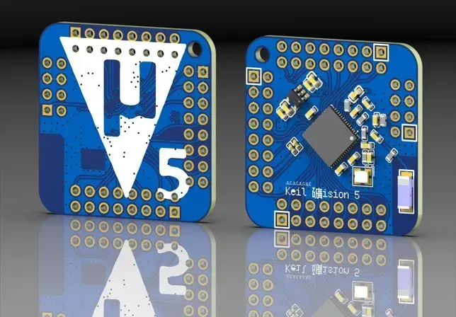

# 基于ESP32最小系统的便携钥匙扣开发板

## 硬件架构

### MCU

- 采用ESP32-S3FH4R2作为主控单元
- 全引脚通过2.54mm排针引出

### 电源管理

- 搭载ME6217C33M5G低压差线性稳压器，支持2-6.5V宽电压输入
- 输出3.3V/800mA稳定供电

### 系统配置

- BOOT/RST引脚预置4.7kΩ上拉电阻
- 集成贴片陶瓷天线
- 采用0402、0603(10uF)封装阻容器件,板框尺寸31.0mm×31.0mm

## 技术规格

|项目|规格|
|--|--|
|工作电压|2.0-6.5V DC|
|最大功耗|850mW@5V输入|

## 制造

仅需下载 [Gerber_Keil_ESP32S3-Minimum-System-Board](Gerber_Keil_ESP32S3-Minimum-System-Board) 文件夹并上传到相应的制造商即可

## 致谢

后背keil-ision-5丝印来自@SinKy
https://oshwhub.com/galiang/keil

---

# ESP32-S3 Minimum System Board

## Hardware Architecture

### MCU

- Uses ESP32-S3FH4R2 as the main control unit
- All pins are exposed through 2.54mm pin headers

### Power Management

- Equipped with ME6217C33M5G low-dropout linear regulator, supporting 2-6.5V wide voltage input
- Provides stable 3.3V/800mA power output

### System Configuration

- BOOT/RST pins with 4.7kΩ pull-up resistors
- Integrated ceramic patch antenna
- Uses 0402, 0603(10uF) package resistors and capacitors, board size 31.0mm×31.0mm

## Technical Specifications

|Item|Specification|
|--|--|
|Operating Voltage|2.0-6.5V DC|
|Maximum Power Consumption|850mW@5V input|

## Manufacturing

Simply download the [Gerber_Keil_ESP32S3-Minimum-System-Board](Gerber_Keil_ESP32S3-Minimum-System-Board) folder and submit it to your PCB manufacturer for production.

## Acknowledgments

Back panel keil-ision-5 silkscreen from @SinKy
